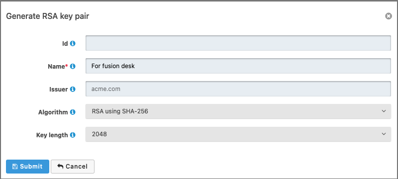
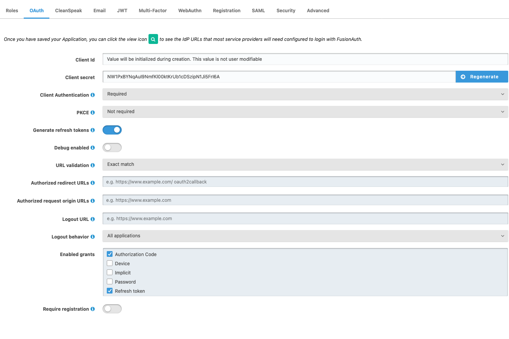
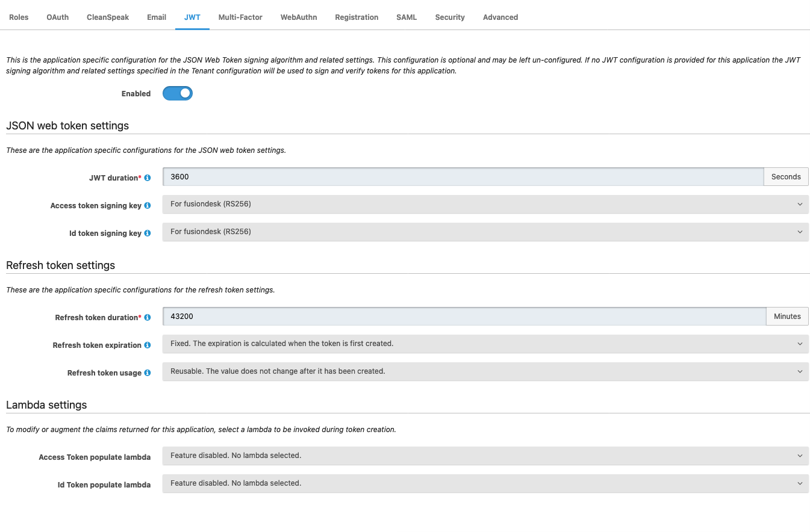
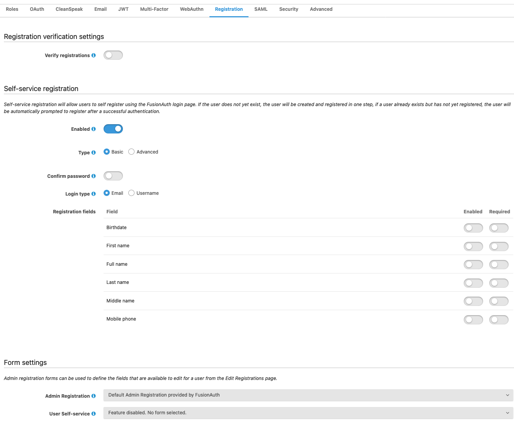
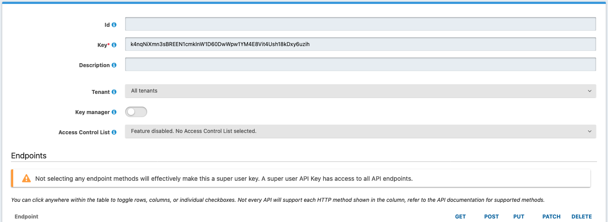

# Fusion Desk

## Introduction

Fusion Desk is an example project using the FusionAuth React SDK. It is a simple help desk application that allows users to create tickets and view their tickets. It is a full stack application that uses React, Node, and FusionAuth.

### Pre-requisites
- Node 14+
- Docker with Docker Compose

## Setup

The example app consists of three parts: kickstart, server, and client. Kickstart contains a predefined set of configurations matching the example app. Server is a Node application that uses Ts.ED. Client is a React application that uses the FusionAuth React SDK.

### Setting up FusionAuth

Skip this step if you already have a FusionAuth instance running.

The root directory contains a `docker-compose.yml` file that will start a FusionAuth instance. It will also start a Postgres and Elasticsearch instance that is used by FusionAuth. Additionally, the kickstart directory contains a `kickstart.json` file that contains the configuration for FusionAuth, a `css/stylesheet.css` file that contains the CSS for the theme, and a `templates` directory that contains the theme templates.

Start the docker containers and wait until they are all running.

```bash
docker compose up -d
```

### Server

The server directory contains a Node application that uses Ts.ED. It is a very powerful framework that allows you to build a server very quickly. It also has a lot of features that make it easy to build a server that is secure and scalable.

```bash
cd server
npm install
cp env.example .env
npm run start
```

With `npm run seed` you can seed the database with some sample data.

### Client

The client directory contains a React application that uses the FusionAuth React SDK. It is a basic application that allows users to create tickets and view their tickets.

```bash
cd client
npm install
cp env.example .env
npm run start
```

## Configure existing FusionAuth instance

If you already have a FusionAuth instance running, we have to make sure that the FusionAuth instance is configured correctly. If you are using the docker-compose file, you can skip this step.

### Create an RSA key pair

Go to `Settings` -> `Key Master` and `Generate RSA key pair`. Enter a name for the key pair and click `Submit`.



### Create an application

Create a new application in FusionAuth. The name of the application can be anything you want.

Add two roles to the application: `customer` and `agent`.
The `customer` role will be used for users that can create tickets and view their tickets.
The `agent` role will be used for users that can view all tickets.
Make sure to enable `isDefault` for the `customer` role.


For OAuth, we need to configure the `Authorized redirect URLs`, `Authorized request origin URLs`, and `Logout URL`. The other settings can be left as default.



Enable JWT and set the `Access token signing key` and `Id token signing key` to the key you created in the previous step.



Enable `Self-service registration`. You can leave the other settings as default.



Save the application. Note down the `Client ID` and `Client secret`.

### Create an API key

Go to `Settings` -> `API keys` and add a new API key. The description of the API key can be anything you want. Note down the API key.



### Edit the environment variables for server and client

Edit the `.env` file in the `server` and `client` directory.
Set the `FUSIONAUTH_CLIENT_ID`, `FUSIONAUTH_CLIENT_SECRET`, and `FUSIONAUTH_API_KEY` to the values you noted down in the previous steps.
Set the `FUSIONAUTH_SERVER_URL` to the URL of your FusionAuth instance.
